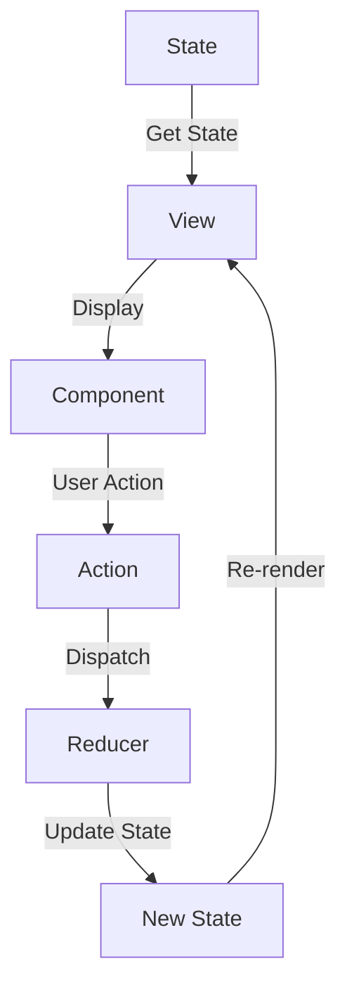

Certainly! Here’s a high-level overview of how Redux works, illustrated through a simple code diagram:

### High-Level Redux Code Diagram



### Explanation

1. **State**:
   - The single source of truth in a Redux application is the state. This is a JavaScript object that holds the entire state of your app.

2. **View**:
   - The UI components that are responsible for displaying the current state of the application.
   - These components subscribe to the store to get the current state and display it.

3. **Component**:
   - Represents the UI parts of your application. These components trigger actions based on user interactions.

4. **Action**:
   - An action is a plain JavaScript object that has a `type` property and optionally additional data.
   - It describes what happened and is dispatched to the store.

5. **Reducer**:
   - A pure function that takes the current state and an action as arguments and returns a new state.
   - Reducers specify how the application's state changes in response to actions sent to the store.

6. **New State**:
   - The updated state returned by the reducer is stored in the Redux store. This new state triggers a re-render of the view.

### Redux Flow

1. **Get State**:
   - The view gets the current state from the Redux store.

2. **Display**:
   - The view displays the current state.

3. **User Action**:
   - The user interacts with the UI, triggering an action (e.g., clicking a button).

4. **Dispatch**:
   - The action is dispatched to the Redux store.

5. **Update State**:
   - The reducer processes the action and returns a new state.

6. **Re-render**:
   - The view re-renders based on the new state.

### Example Code

Here’s a simple example to illustrate:

```javascript
// Action Type
const INCREMENT = 'INCREMENT';

// Action Creator
const increment = () => ({
  type: INCREMENT,
});

// Reducer
const counter = (state = 0, action) => {
  switch (action.type) {
    case INCREMENT:
      return state + 1;
    default:
      return state;
  }
};

// Store
const { createStore } = require('redux');
const store = createStore(counter);

// View (e.g., React Component)
store.subscribe(() => console.log(store.getState()));
store.dispatch(increment());  // User clicks a button, increment action dispatched
store.dispatch(increment());  // User clicks a button again, another increment action dispatched
```

This code snippet shows the basic structure of a Redux application, including actions, reducers, and the store. 
The store holds the state, the reducer updates the state based on actions, and the view subscribes to state changes.
