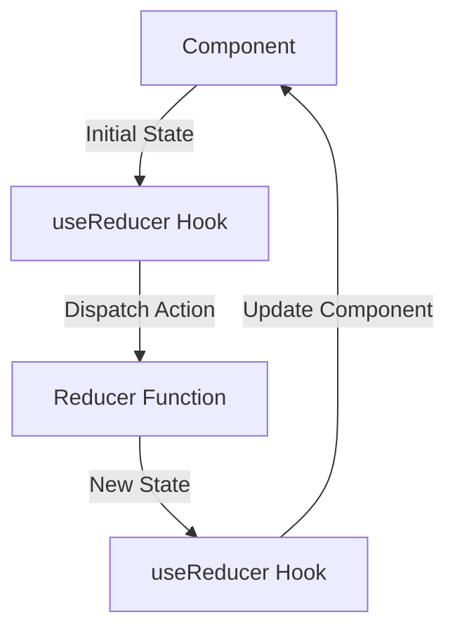

Sure! Here’s a high-level overview of how the `useReducer` hook works in React, illustrated through a simple code diagram:

### High-Level useReducer Diagram



### Explanation

1. **Component**:
   - The React component that uses the `useReducer` hook to manage its state.

2. **useReducer Hook**:
   - The `useReducer` hook initializes the state and provides a dispatch function to send actions to the reducer. It takes two arguments: the reducer function and the initial state, and returns the current state and the dispatch function.

3. **Dispatch Action**:
   - When an action is dispatched using the `dispatch` function, it triggers the reducer function with the current state and the action.

4. **Reducer Function**:
   - A pure function that takes the current state and an action as arguments and returns a new state based on the action type and payload.

5. **New State**:
   - The new state returned by the reducer function updates the state managed by the `useReducer` hook.

6. **Update Component**:
   - The component re-renders with the new state.

### Example Code

Here’s a simple example to illustrate:

```javascript
import React, { useReducer } from 'react';

// Initial State
const initialState = { count: 0 };

// Reducer Function
const reducer = (state, action) => {
  switch (action.type) {
    case 'increment':
      return { count: state.count + 1 };
    case 'decrement':
      return { count: state.count - 1 };
    default:
      throw new Error();
  }
};

// Component
const Counter = () => {
  const [state, dispatch] = useReducer(reducer, initialState);

  return (
    <div>
      <p>Count: {state.count}</p>
      <button onClick={() => dispatch({ type: 'increment' })}>+</button>
      <button onClick={() => dispatch({ type: 'decrement' })}>-</button>
    </div>
  );
};

export default Counter;
```

### Step-by-Step Flow

1. **Initial State**:
   - `const initialState = { count: 0 };` defines the initial state.

2. **Reducer Function**:
   - `const reducer = (state, action) => { ... };` defines how the state changes based on actions.

3. **useReducer Hook**:
   - `const [state, dispatch] = useReducer(reducer, initialState);` initializes the state and provides a dispatch function to send actions to the reducer.

4. **Dispatch Action**:
   - The buttons in the `Counter` component dispatch actions to the reducer. For example, `dispatch({ type: 'increment' })` sends an increment action.

5. **New State**:
   - The reducer processes the action and returns a new state, which updates the `state` in the component.

6. **Update Component**:
   - The component re-renders with the updated state.

### Visualizing useReducer

- **Component**: The React component that uses `useReducer` to manage state.
- **useReducer**: Provides state management with a reducer function and a dispatch method.
- **Reducer Function**: Determines how the state should change in response to actions.
- **Dispatch Action**: Triggers the reducer to update the state.

This setup ensures a predictable state management pattern, making it easier to handle complex state logic compared to `useState`. 
It is especially useful for managing state that involves multiple sub-values or complex transitions.
